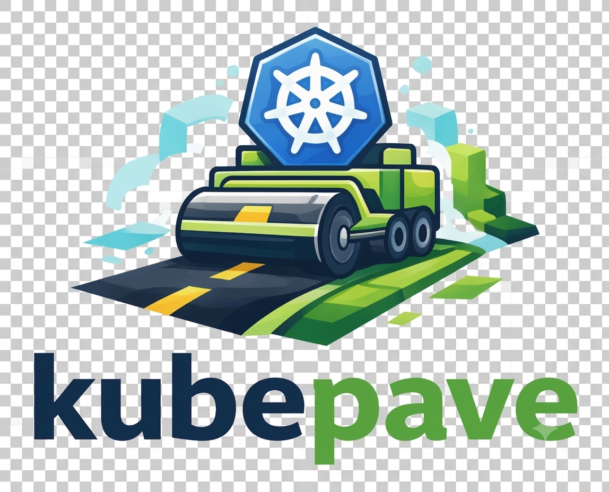

<p align="center" width="100%">
    
</p>
<p align="center" >
  A paved road to Kubernetes for developers.
  This repository serves as a central hub for managing platform-related tools
  and configurations.
</p>
<p align="center" >
  
  
  
  

</p>

## 🚀 Getting started

### Bootstrap Azure EntraID (OpenTofu)

`/src/bootstrap/azure` bootstraps identity resources in Microsoft Entra ID using OpenTofu.

It provisions:
- App registrations (Argo CD, Crossplane, Keycloak, Backstage)
- Service Principals (Enterprise Applications)
- App Roles and RBAC assignments
- Required API permissions

#### Prerequisites

After you [install Azure CLI](https://learn.microsoft.com/en-us/cli/azure/install-azure-cli?view=azure-cli-latest), login to Azure:
```bash
az login
```

You may want to verify the active tenant:
```bash
az account show
```

[Install OpenTofu](https://opentofu.org/docs/intro/install/):
```bash
tofu version
```
Make sure **GPG** is installed (it is usually included by default on Ubuntu). This is needed because it is used to encrypt Tofu Statefile before pushing to Git repository:
```bash
gpg --version
```
[Install GnuPG](https://www.gnupg.org/download/).

**Initialize & apply**:
```bash
task azure:up
```
**Destoy**:
```bash
task azure:down
```

#### State management (no cloud backend):

- State is stored locally and encrypted before committing to Git repository.
- Yes, this is a bit manual; that’s the price of avoiding a paid backend 🙂.

- When you run `task azure:up`, encryption and decryption of the Terraform state file are handled automatically.

If you need to manage it manually:

**Encrypt the state file:**
```bash
gpg --encrypt --recipient "$(pass private/tofu/gpg-recipient)" terraform.tfstate
```

Decrypt the state file:
```bash
gpg -d terraform.tfstate.gpg > terraform.tfstate
```

I stored the GPG key in my local password manager, [pass](https://www.passwordstore.org/).

Commit encrypted file:
```
git add terraform.tfstate.gpg
git commit -m "Add encrypted state"
```
Note: `*.tfstate` and `*.tftstate.backup` are git-ignored. 

### Bootstrap

Make sure [Task is installed](https://taskfile.dev/docs/installation) on your local machine.

```
task --version
```

Clone the repository:
```bash
git clone git@github.com:rezakaramad/kubepave.git && cd kubepave
```
Check dependencies:

```bash
task check
```

Bootstrap everything at once:

```bash
task kind:up
```

Load the Argo CD admin password and Vault token into your shell:

```bash
source .platform.env
```

Copy secrets to your clipboard:

```bash
printf %s "$VAULT_ROOT_TOKEN" | xclip -selection clipboard
```
```bash
printf %s "$ARGOCD_ADMIN_PASSWORD" | xclip -selection clipboard
```

## 🧹 Destroy everything

```bash
task kind:down
```
---

#### Argo CD SSO
After the platform boots up, you must restart the Argo CD server to enable SSO.
During bootstrap, OIDC is configured and the `argocd-secret` is updated with the OIDC client secret. However, the `argocd-server` does not automatically reload this secret, which causes SSO login to fail (e.g. `invalid_client errors`).

To ensure Argo CD picks up the updated client secret, restart the server:
```
kubectl rollout restart deployment argocd-server -n argocd
```
> ⚠️ This is a one-time requirement after bootstrap or whenever the OIDC client secret changes.

## Why Task

Task lets you define:
- which scripts run
- in what order
- with which variables
All in a clean and readable way — nothing fancy.

Compared to a **Makefile**, Task feels simpler and more human-friendly.  
Make is extremely powerful, but its syntax and behavior were originally designed for build systems rather than general project automation.

Tools like **Just** take a similar approach to improving the developer experience.  
A **Justfile** is great for running small command recipes and replacing simple Makefiles, but it focuses more on being a command runner than a task orchestrator.

**Task**, on the other hand, provides features that fit this project better:
- explicit task dependencies
- built-in parallel execution
- environment and variable handling
- cross-platform behavior

So while **Make**, **Just**, and **Task** all solve similar problems, Task strikes a nice balance between simplicity and automation for this repository.

But there’s no perfect tool for everyone — and this is no exception.

## Where does it run?

It started with Minikube for local development. It now uses Kind to keep the setup lightweight and to make the networking less complex.

It may later be extended to support additional environments, including AWS and GCP.

For local setup, plain **shell scripts** work best, they run everywhere without extra dependencies.
You don't have to use the scripts, but they make bootstrapping easier.

So the repo uses a few scripts to:
- start clusters
- install components
- wire everything together

to get you up and running quickly.

The scripts are only used for local setup. Cloud environments will be fired up with OpenTofu.

## Minikube Driver
### Why KVM instead of Docker?

This setup runs multiple Kubernetes clusters (`management` and `workload`) that need to talk to each other reliably.

The Docker driver is easy to start with, but each Minikube profile runs in its own isolated Docker network. This makes cross-cluster communication difficult and often requires extra workarounds like port forwarding, tunnels, or custom routing.

The **KVM** (`kvm2`) driver runs each cluster as a small virtual machine on the same shared network. This gives us:
- simple, direct networking between clusters
- predictable IP addresses
- no Docker NAT or hidden firewall rules
- behavior closer to real infrastructure
- fewer hacks and special setup

👉 To learn how to install KVM follow the [installation guide](https://help.ubuntu.com/community/KVM/Installation).

# Repository Structure

| Component | Location | Description |
|-----------|----------|-------------|
| **Argo CD** | `argocd-applications/` | Contains all Argo CD resources. |
| **Helm Charts** | `charts/` | Contains Helm charts used by the platform. We depend on official upstream charts and compose them as dependencies. |
| **Bootstrap Infrastructure** | `infra` | Resources and scripts required to spin up the infrastructure. |
| **Crossplane Functions** | `src/crossplane/` | Contains Crossplane functions used by the platform. |

Made with 🤓, 🐧 and 🍷.
