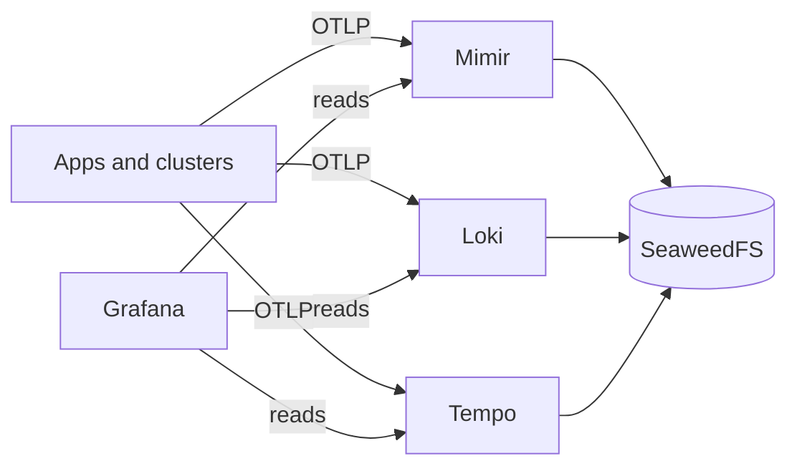

# lgtm-grafana

This chart deploys the Grafana operator, one Grafana instance and its Mimir, Loki and Tempo datasources.

Think of the stack as **LGTM**:

| Tool | Job in one line | Talks to you at |
| --- | --- | --- |
| Loki | Keeps the **logs** | `loki.mgmt.rezakara.demo` |
| Grafana | The **screen** you actually look at | `grafana.mgmt.rezakara.demo` |
| Tempo | Keeps the **traces** (who called whom, how slow) | `tempo.mgmt.rezakara.demo` |
| Mimir | Keeps the **metrics** (numbers over time) | `mimir.mgmt.rezakara.demo` |

Plus **SeaweedFS**, an S3-compatible object store. Loki, Tempo and Mimir keep their data there. It replaced MinIO, which is deprecated.

**Why do we need object storage?**

- **The problem**: Logs, traces and metrics pile up fast, and they have to outlive any single pod. Pods restart and move, and a local disk doesn't follow them. EBS-backed volumes solve the persistence problem, but managing and scaling them as data grows adds overhead. EFS allows sharing data across pods, but comes with higher storage costs and potential throughput bottlenecks.

- **What it gives us**: Cheap, big, shared storage that grows on its own, separate from the pods that use it. We can keep hot data on faster local storage (like EBS) for quick reads and writes, while storing historical data in S3, where low latency matters less. This also lets us scale ingestion and querying independently without worrying about storage capacity.

- **Is it mandatory**? For Mimir, effectively yes: its ingesters, store-gateways and compactors are separate pods that need access to the same data blocks. For Loki and Tempo, it's strongly recommended for production rather than strictly required. They can use local filesystem storage for smaller setups, but that limits how far we can scale without changing the storage architecture.

Everything runs on the **management** cluster, in the `observability` namespace. Other clusters will send their data here over OTLP/HTTP through the Traefik routes above.

## The picture



Heads up: the collectors that ship data from clusters aren't in yet. Right now you can push to the endpoints by hand.

## How Grafana is deployed

Grafana runs with the **Grafana operator**, not the plain Helm chart. Three small pieces:

1. **The operator** watches the cluster and does the work.
2. **A `Grafana` resource** ([templates/grafana.yaml](templates/grafana.yaml)) is the instance itself: login settings, disk, secrets.
3. **`GrafanaDatasource` resources** ([templates/datasources.yaml](templates/datasources.yaml)) wire in Mimir, Loki and Tempo.

Why bother? Because dashboards and datasources become normal Kubernetes objects. Tomorrow a tenant can ship their own dashboard from their own namespace, with no clicking around in the UI.

**Login is Entra ID.** Members of `platform-admins` land as Admin, `platform-viewers` as Viewer. There's also a break-glass local `admin` user, with the password kept in OpenBao.

## Secrets, the short version

- The namespace has **one** SecretStore, `openbao-local` (created by the `observability` chart). It logs in to OpenBao as role `observability`, which can read `kv/seaweedfs/*` and `kv/grafana/*`. Same pattern as every other namespace.
- Loki, Tempo and Mimir hold **no S3 keys**. Each trades its own Kubernetes ServiceAccount token for short-lived S3 credentials (STS). SeaweedFS checks the token, so there is nothing to leak or rotate.

## Gotchas you will meet

- Changed an OpenBao policy? Sync the `openbao` app, then delete `openbao-0`. The policies are written when the pod starts, and nothing restarts it for you.
- Changed the SeaweedFS IAM config? Restart the SeaweedFS pod, since it doesn't reload on its own.
- Backends complaining `Access Denied` after about an hour? Suspect the short-lived S3 credential not renewing (we haven't watched a full renewal yet). Look at the SeaweedFS logs first.

## Quick health check

```fish
kubectl --context kind-management -n observability get pods
kubectl --context kind-management -n observability get externalsecret
kubectl --context kind-management -n observability get grafana,grafanadatasource
```

Everything Ready, every ExternalSecret `SecretSynced`, and you're good.
