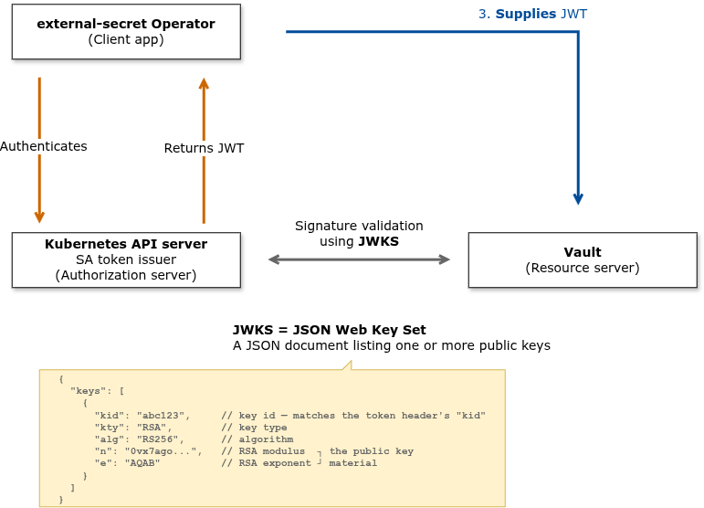
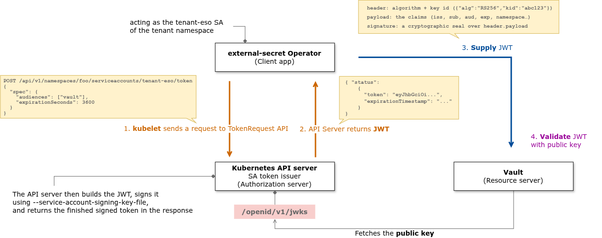

**TokenReview** is a Kubernetes API (`authentication.k8s.io/v1`, kind `TokenReview`) that answers one question:
> "Here's a token. Is it valid, and if so, who does it belong to?"

You hand it a bearer token; it hands back whether the token is authenticated and, if so, the user identity it maps to, username, UID, and groups.

TokenReview exposes that same validation logic as an API so that other components don't have to reimplement it. Instead of a service parsing JWTs, fetching signing keys, checking expiry, and knowing every token format, it just asks the API server: "you validate this for me."

This is the classic token introspection pattern (like OAuth2's introspection endpoint) — centralize "*is this token good?*" in the authority that issued/knows the tokens.

**How it works**
You POST a TokenReview object with the token in the spec:
```yaml
apiVersion: authentication.k8s.io/v1
kind: TokenReview
spec:
  token: "eyJhbGciOi..."      # the token to check
  audiences: ["vault"]  
```
The API server responds by filling in status:
```yaml
status:
  authenticated: true
  user:
    username: system:serviceaccount:foo:tenant-eso
    uid: 5f3c...
    groups:
      - system:serviceaccounts
      - system:serviceaccounts:foo
  audiences: ["vault"]
```

If the token is expired, malformed, or the pod/SA it belongs to was deleted, you get authenticated: false. That "live" check is the key property — it reflects the cluster's current state, not just what was true when the token was signed.

**Who uses it (beyond Vault)**

- Any service that accepts K8s SA tokens as login credentials.
- Authenticating webhooks — the API server itself calls an external TokenReview-style webhook when configured with a webhook token authenticator.
- `kubectl auth` tooling and anything doing "*verify this identity for me*".

The general pattern: a development presents its SA token to some service; that service delegates validation to the cluster via TokenReview instead of trusting the token blindly.

**The counterpart APIs (so it clicks)**
Kubernetes splits auth into small, composable APIs — worth knowing together:

API	Question it answers
TokenReview	Authentication — "who is this token?"
SubjectAccessReview	Authorization — "is this user allowed to do X?"
TokenRequest	Issuance — "mint me a short-lived, audience-bound token for this SA."
TokenReview (verify) and TokenRequest (mint) are two ends of the same lifecycle: TokenRequest creates the projected SA token your pod carries; TokenReview is how a server later checks it.

**Permissions note**
Calling TokenReview isn't open: the caller needs RBAC permission (`create` on `tokenreviews`), granted via the built-in `system:auth-delegator` ClusterRole. 

---

The question that popped into my mind was: *how does K8s RBAC works for an external identity?*

Well, actually, there's no "internal vs external" axis in K8s auth. Every request to the API server goes through the same pipeline:

A pod inside the cluster and Vault on another machine both arrive at the API server as an HTTPS request with a credential. The API server resolves that credential to a username/groups, then checks RBAC against that identity. Location is irrelevant; identity is everything.

So the real question becomes: *how does external Vault get an identity the API server accepts?*.

**How an external caller gets an identity**

1. **A ServiceAccount token (most common for Vault's Kubernetes auth method)**.
You create an SA in the cluster (e.g. vault-reviewer), bind it to system:auth-delegator, and give Vault that SA's token. Vault stores it as the "reviewer JWT" and presents it on every TokenReview call:

```yaml
apiVersion: v1
kind: ServiceAccount
metadata:
  name: vault-reviewer
  namespace: vault-auth
---
apiVersion: rbac.authorization.k8s.io/v1
kind: ClusterRoleBinding
metadata:
  name: vault-token-reviewer
roleRef:
  apiGroup: rbac.authorization.k8s.io
  kind: ClusterRole
  name: system:auth-delegator      # grants create on tokenreviews + subjectaccessreviews
subjects:
  - kind: ServiceAccount
    name: vault-reviewer
    namespace: vault-auth
```

To the API server, Vault is `system:serviceaccount:vault-auth:vault-reviewer`. An SA token is just a bearer credential, nothing stops it being used from outside the cluster. This is exactly the "*long-lived token as reviewer JWT*" option from your earlier list.

2. A client certificate. Vault presents a TLS client cert whose subject maps to a username/group (via the API server's `--client-ca-file`). RBAC then binds to that username. Common for out-of-cluster automation.
[Further reading.](#using-a-client-certificate-to-authenticate-against-k8s-api)

3. An OIDC / external identity. If the API server is configured with an OIDC issuer (or a cloud IAM integration like EKS/GKE), Vault authenticates as an OIDC user and RBAC binds to that user/group.

In all three, the pattern is identical: 

external caller → obtains a cluster-recognized credential → API server maps it to an identity → RBAC on that identity.

This is more about **Kubernetes auth** method versus **JWT auth**.

In JWT auth,
Vault never calls TokenReview at all, and therefore needs no reviewer credential and no RBAC in the development cluster. Instead:
- Vault only needs to fetch the cluster's public JWKS (the SA-token signing keys): an unauthenticated, read-only endpoint.
- No secret, no reviewer SA, no `system:auth-delegator` binding on the remote cluster.

[Read about JWKS (JSON Web Key Sets)](https://supertokens.com/blog/understanding-jwks).

JWTs or JSON Web Tokens are commonly used to identify authenticated users and validate API requests. Part of this verification uses cryptographic keys to check the **JWT's integrity** — that it hasn't been tampered with

The set of public keys used for this process is called **JWKS** or **JSON Web Key Set**.



Here's how this maps onto Kubernetes:

In Kubernetes, the API server is the signer: it signs each ServiceAccount token with its private key and publishes the matching public keys at `/openid/v1/jwks`. Vault fetches those keys once and uses them to validate every token offline; no call back to the cluster.



---

## Using a client certificate to authenticate against K8s API

Kubernetes can authenticate you by the TLS client certificate you present during the HTTPS handshake. There's no token, no SA, no TokenReview. The API server reads the identity straight out of the certificate:
- The cert's Common Name (CN) → becomes your username.
- The cert's Organization (O) fields → become your groups.
So a cert with `CN=vault, O=vault-clients` makes the API server treat the request as user vault, group `vault-clients`. RBAC then binds permissions to that username/group. That's the whole mechanism.

Why --client-ca-file is the linchpin
The API server won't trust just any certificate — anyone can generate one claiming CN=admin. So the API server is started with a flag:

```yaml
kube-apiserver --client-ca-file=/etc/kubernetes/pki/ca.crt
```

This says: "*I will only accept client certs signed by this CA*" The trust chain is:

```
Vault's client cert  - signed by --> CA in --client-ca-file  - trusted by -->  API server
```

If the presented cert chains up to that CA, the API server believes the CN/O inside it. If not, the handshake identity is rejected (401). So whoever controls that CA controls who can mint valid identities, you'd sign a cert for Vault with `CN=vault`.

This is the key contrast with option 1:

|    | Bearer token (SA token)  | Client certificate |
|--- |---                       |---                 |
| **Where identity lives** | In the token payload (a JWT) | In the X.509 certificate subject (`CN` / `O`) |
| **When it's checked** | The API server validates the token after the connection is established | During the **TLS handshake itself** |
| **What proves it's yours** | Possession of the token string | Possession of the certificate's **private key** via mutual TLS (mTLS) |
| **Revocation** | Token expiry / `TokenReview` | Certificate expiry; revocation is generally awkward in Kubernetes |

With a client certificate, Vault proves its identity by completing a **mutual TLS (mTLS)** handshake. It presents the certificate and proves that it holds the matching private key.

This means the client's identity is established **before any API request body is sent**.
