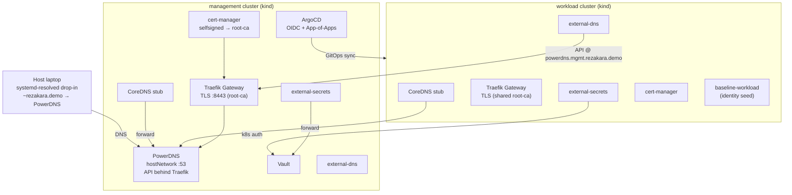

# Architecture & Design Decisions

This document captures the *why* behind the local kind environment. For setup and
usage see [README.md](README.md).

---

## Overview

Two kind clusters model a real platform:

- **management** — runs the platform control plane (ArgoCD, Vault, PowerDNS,
  cert-manager, external-secrets, Traefik).
- **workload** — a tenant cluster whose platform components are installed by
  ArgoCD via GitOps.



---

## kind over minikube

kind is lighter and faster to tear down and recreate than minikube with a VM
driver. Both clusters run as Docker containers on a single `kind` bridge network,
so pods in one cluster can reach nodes in the other directly — no tunnels.

Cluster names are `management` and `workload`; kube contexts are therefore
`kind-management` and `kind-workload`.

---

## DNS without a laptop daemon

**Goal:** avoid installing a DNS daemon (dnsmasq) that reshapes the host's global
resolver config.

**Solution:** PowerDNS runs *inside* the management cluster with `hostNetwork:
true`, binding `:53` on the management node's Docker-bridge IP. Three consumers
reach it:

- **Host** — a two-line systemd-resolved drop-in
  (`/etc/systemd/resolved.conf.d/rezakara.conf`) routes only `~rezakara.demo` to
  PowerDNS. Nothing else about the host resolver changes.
- **Management pods** — CoreDNS is patched with a stub zone forwarding
  `rezakara.demo` to the PowerDNS node IP.
- **Workload pods** — same CoreDNS stub, reaching PowerDNS across the kind bridge.

`hostNetwork` (rather than a metallb LoadBalancer IP) is used because the node IP
is routable from pods in *both* clusters and from the host, whereas a metallb IP
in the management cluster is not reachable from the workload pod network.

### Why keep external-dns + PowerDNS

This mirrors the real cloud model: applications create Gateway API `HTTPRoute`s,
external-dns observes them and writes records into a DNS provider's API (PowerDNS
here, Cloud DNS in production). Keeping this loop locally exercises the same code
paths as production instead of a simplified hosts-file hack.

---

## TLS chain

cert-manager builds a local PKI:

```
selfsigned (ClusterIssuer)
  └── root-ca (Certificate, CA)
        └── root-ca (ClusterIssuer)
              └── *.mgmt.rezakara.demo (wildcard, issued to Traefik)
```

`baseline-management` provisions the `selfsigned` → `root-ca` chain. Traefik's
Gateway is annotated with `cert-manager.io/cluster-issuer: root-ca`, so
cert-manager mints the wildcard cert and Traefik terminates HTTPS on `:8443`.

The root CA is pushed to Vault (`management/pki`) via an external-secrets
`PushSecret`. `setup-trust.sh` pulls it back out and installs it into the host's
Java, browser (NSS), and system trust stores, and seeds the `root-ca` secret into
the workload cluster — so the **same** CA is trusted across host and both clusters.

---

## Secrets: Vault + external-secrets

Vault (KV v2 at mount `local`) is the source of truth for all secrets. Bootstrap
scripts write secrets from `pass`; external-secrets materialises them into
Kubernetes as needed.

- The **management** cluster uses a `ClusterSecretStore` (`vault-local`) that
  reaches Vault over its HTTPS route and authenticates via Kubernetes auth.
- The **workload** cluster uses a `SecretStore` and a dedicated Vault auth backend
  (`kubernetes-workload`) configured by `setup-vault.sh`.

> **Operational note:** the local `vault` CLI version may differ from the server.
> All bootstrap scripts run `vault` commands *inside* the `vault-0` pod
> (`kubectl exec`) to avoid client/server version-mismatch errors.

---

## GitOps model for the workload cluster

Workload platform components (cert-manager, external-secrets, Traefik,
external-dns) are **not** installed imperatively — ArgoCD installs them by syncing
`argocd-applications/local/workload/`.

The flow:

1. `setup-secrets.sh` creates an `argocd-manager` ServiceAccount with a long-lived
   token in the workload cluster and stores `server` + `token` in Vault.
2. `gitops-platform`'s `clusters-credential` ExternalSecret materialises the
   ArgoCD **cluster Secret** (pull model — ArgoCD connects out to the workload API).
3. `gitops-platform`'s App-of-Apps (`platform-application-folder`) points at
   `argocd-applications/local/workload/` with `directory.recurse: true`.
4. ArgoCD reconciles those Applications, installing the workload platform stack.

Because ArgoCD reads from **Git**, chart and Application changes must be committed
and pushed before they take effect.

### Why `baseline-workload` is bootstrapped imperatively

Everything on the workload cluster could be GitOps-managed *except* its identity
seed. `baseline-workload` creates the `vault-reviewer` ServiceAccount (bound to
`system:auth-delegator`), the `SecretStore`, and the `root-ca` issuer.

The dependency cycle that forces it to exist first:

```
vault-reviewer SA must exist
  → setup-vault.sh can configure Vault's kubernetes-workload auth
    → workload external-secrets can authenticate to Vault
      → ArgoCD-managed apps that need secrets actually work
```

You cannot GitOps your way *into* a cluster that GitOps does not yet have
credentials for. The identity seed is planted by hand; everything else is GitOps.

### PowerDNS API at a stable hostname

Workload external-dns must reach the management PowerDNS API. The management node
IP changes when kind clusters are recreated, and ArgoCD applies static YAML from
Git, so it cannot inject a runtime IP.

Instead the PowerDNS API is exposed behind the management Traefik at a stable
hostname (`powerdns.mgmt.rezakara.demo`). Workload external-dns targets that URL
with `--pdns-skip-tls-verify` (local self-signed CA). This keeps the whole workload
stack in GitOps and portable across cluster recreation — and mirrors the cloud
model of talking to a DNS API over a stable endpoint.

---

## ArgoCD authentication

ArgoCD runs with Azure AD OIDC enabled (same config as the cloud/minikube setup),
with the local `admin` account retained as a fallback. The Azure client secret is
read from Vault into `argocd-secret` by an external-secrets `ExternalSecret`.
Because OIDC requires a working HTTPS URL, this depends on the TLS chain being up.

---

## Networking summary

| Concern | Mechanism |
|---------|-----------|
| LoadBalancer IPs | metallb (L2), pools carved from the kind bridge CIDR |
| Cross-cluster reachability | shared `kind` Docker bridge network |
| DNS (host) | systemd-resolved drop-in → PowerDNS node IP |
| DNS (pods) | CoreDNS stub zone → PowerDNS node IP |
| Ingress | Traefik + Gateway API, TLS via root-ca |
| Record automation | external-dns → PowerDNS API |
